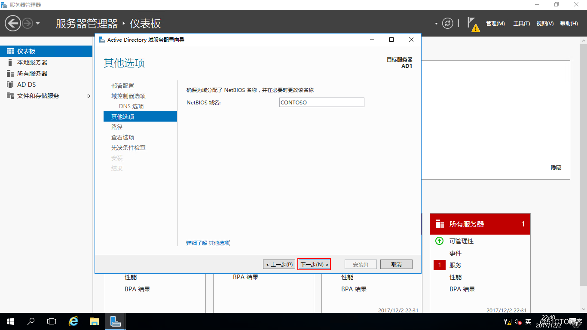

## 简述

 [AD](https://docs.microsoft.com/zh-cn/windows-server/identity/ad-ds/active-directory-domain-services)是Active Directory的简写，中文称活动目录。活动目录(Active Directory)主要提供以下功能：1、服务器及客户端计算机管理，2、用户服务，3、资源管理，4、桌面配置，5、应用系统支撑等；更多AD DS概述请查看 [微软技术文档](https://docs.microsoft.com/zh-cn/windows-server/identity/ad-ds/get-started/virtual-dc/active-directory-domain-services-overview),本文详细介绍AD DS的部署。

## 主题：

-   部署环境
-   森林模型
-   角色安装
-   运行部署向导

## 部署环境
| 编号        | 服务器名称           | IP地址  |操作系统|
| ------------- |:-------------:| -----:|:-------------:|
| 001      | AD1| 192.168.100.250 |Windows Server 2016 Datacenter Evaluation|
## 森林模型


## 角色安装

在需要安装AD域控制器的电脑上打开服务器管理器，点击“添加角色和功能”  
  
打开“添加角色和功能向导”，点击“下一步”  
  
安装类型选择“基于角色或基于功能的安装”，点击“下一步”  
  
服务器选择“从服务器池中选择服务器”，再选中池中的本地服务器，点击“下一步”  
  
服务器角色选择“Active Directory域服务”，会弹出“添加Active Directory域服务所需的功能？”，点击“添加功能”  
  
服务器角色选择“Active Directory域服务”之后，点击“下一步”  
  
点击“下一步”  
  
点击“下一步”  
  
确认这里把“如果需要，自动重新启动目标服务器”打勾，点“安装”  
  
正在安装  
  
Active Directory域服务角色安装完成，点“关闭”  


## 运行部署向导

运行AD DS（Active Directory域服务的简称）部署向导，打开本地服务器的服务器管理器，点“通知”-“将此服务器提升为域控制器”  
  
打开AD DS的部署向导，由于我们这里是部署新的AD控制器，所以部署配置选择“添加新林”，把“根域名”设置成“contoso.com”，点击“下一步  
解释：  
将域控制器添加到现有域：在现有的域控制器中添加新的域控制器  
将新域添加到现有林：在现有的林中新建域，与林中现有的域不同  
添加新林：在没有林的情况下新建林  
  
域控制器选项：  
林功能级别（包含Windows Server 2008到Windows Server 2016级别都有）：
指定域控制器功能：默认  
键入目录服务还原模式（DSRM）密码（自己设置复杂性密码）：*********  
点击“下一步”  
  
点击“下一步”  
  
点击“下一步”  
  
AD DS的数据库、日志文件和SYSVOL的位置我们指定在D盘目录下，当然也可以默认，为了安全起见我们还是放D盘，点击“下一步”  
  
点击“下一步”  
  
先决条件检查通过，点击“安装”，如果不通过请根据提示查看原因  
  
正在进行自动部署，部署完成后会自动重启服务器  
  
AD域控制器部署完成，打开“服务器管理器”-“工具”-“Active Directory用户和计算机”  
  
就可以看到我们刚才部署好的域，这样一个完整的域就部署完成了  


# FAQ
## 用户操作
### 添加用户时遇到密码策略的问题


1. 打开服务管理器
2. `工具`里选择`组策略管理`
3. 右键选择`Edit`（编辑）,点击:`Computer Configuration（计算机配置）–Policies（策略）–Windows Settings（Windows设置）–Security Settings（安全设置）`
4. 双击'`密码策略`',选择禁用

5. 更新一下，使策略修改生效。


```shell
#
# 用于 AD DS 部署的 Windows PowerShell 脚本
#

Import-Module ADDSDeployment
Install-ADDSForest `
-CreateDnsDelegation:$false `
-DatabasePath "C:\Windows\NTDS" `
-DomainMode "Win2012R2" `
-DomainName "dms.org" `
-DomainNetbiosName "DMS" `
-ForestMode "Win2012R2" `
-InstallDns:$true `
-LogPath "C:\Windows\NTDS" `
-NoRebootOnCompletion:$false `
-SysvolPath "C:\Windows\SYSVOL" `
-Force:$true


```
