# DNS 安装
## 主DNS服务器安装

由于在先前安装AD服务器的时候，已经配置了相应的DNS服务器，这里就不需要再重新安装了。

## 从DNS服务器安装
### 登录到slave server上， 按照以下步骤：
[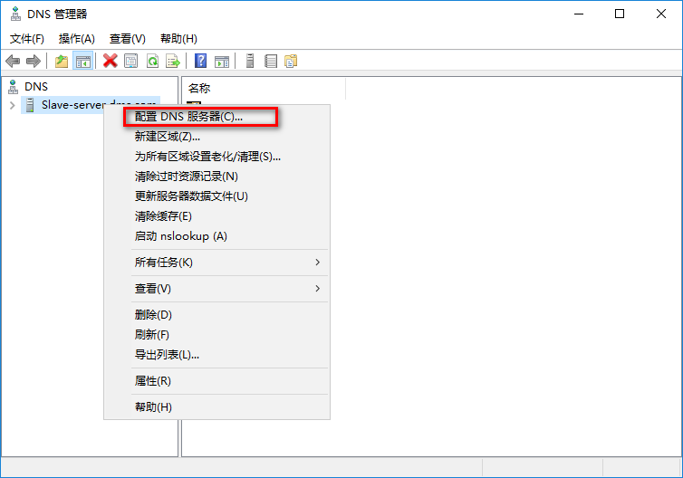](https://imgtu.com/i/5VkrZQ)
[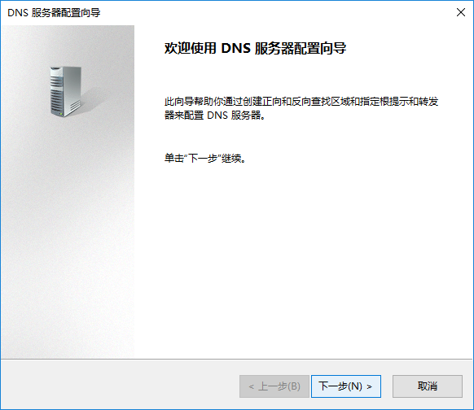](https://imgtu.com/i/5VkBqg)
[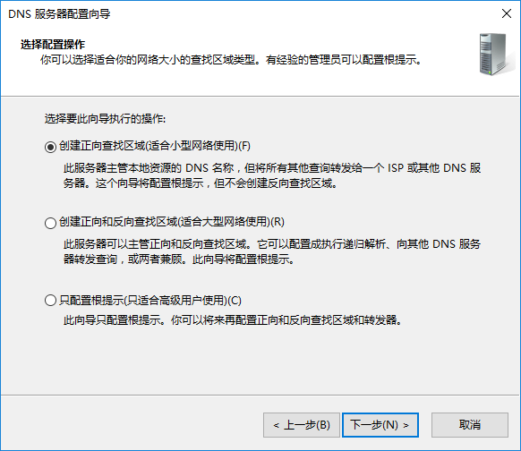](https://imgtu.com/i/5VkgGq)
[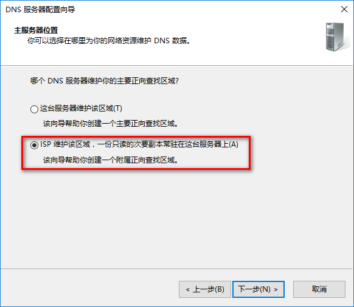](https://imgtu.com/i/5Vkcin)
[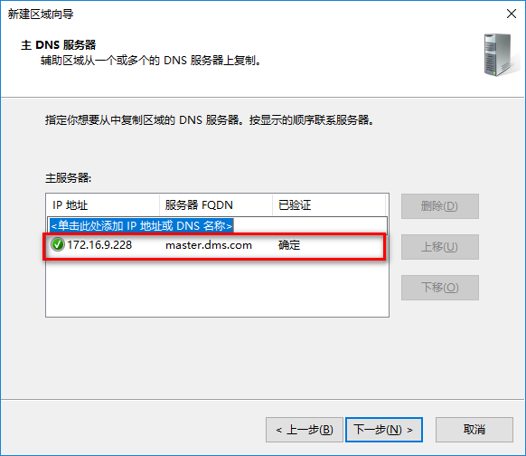](https://imgtu.com/i/5Vk0sS)
[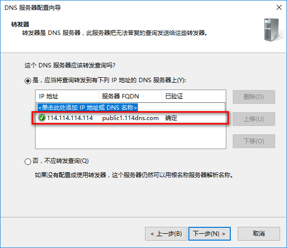](https://imgtu.com/i/5Vksaj)
[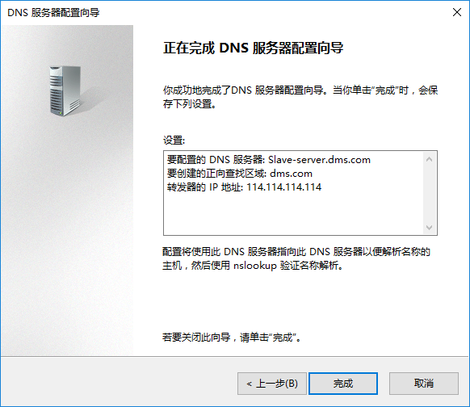](https://imgtu.com/i/5Vk2R0)

### 这个时候可能会出现下边的问题：

[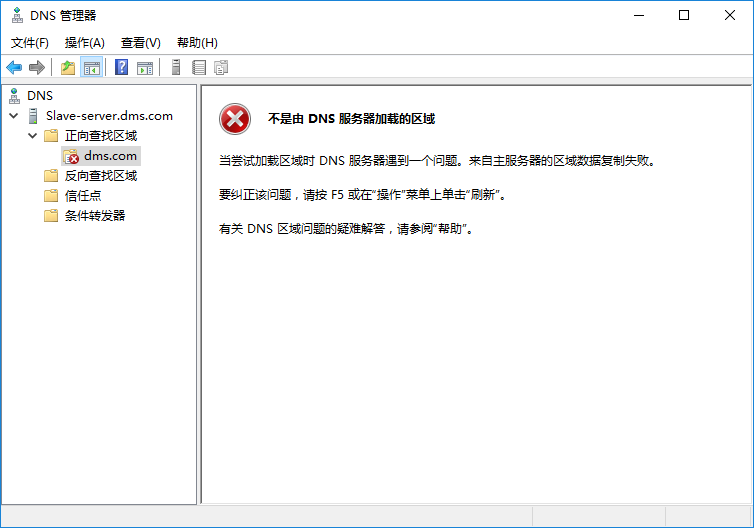](https://imgtu.com/i/5VkyIs)

对于第一次配置DNS服务器可能会遇到配置好了DNS辅助区域，但是无法从DNS服务器更新数据的情况，如下图：  
当尝试加载区域时DNS服务器遇到一个问题。来自主服务器的区域数据复制失败。  
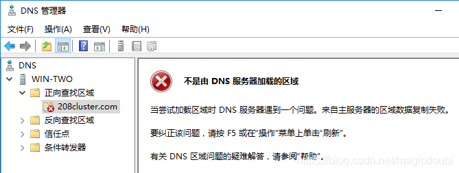  
对于这种问题可以，在DNS主要区域进行如下设置  
1.来到DNS主服务器，先打开dns管理器  
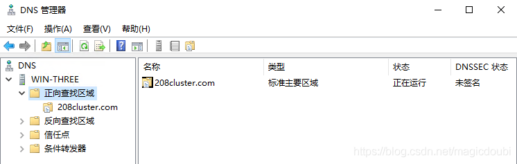  
2.右击208cluster.com(这里你的名称和我的应该不同)  
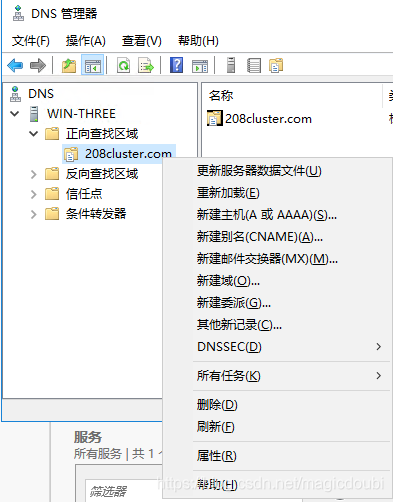  
3.点击属性，进入后找到区域传送  
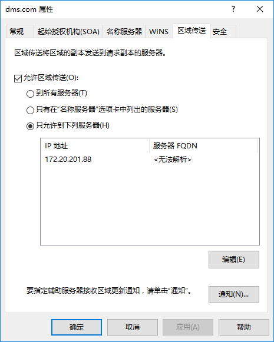](https://imgtu.com/i/5VkRzV)
默认的话就是“只有在名称服务器选项卡中列出的服务器”  
你可以选择“到所有服务器”，然后确定  
4\. 回到你的DNS辅助区域右击选择“从主服务器传送”  
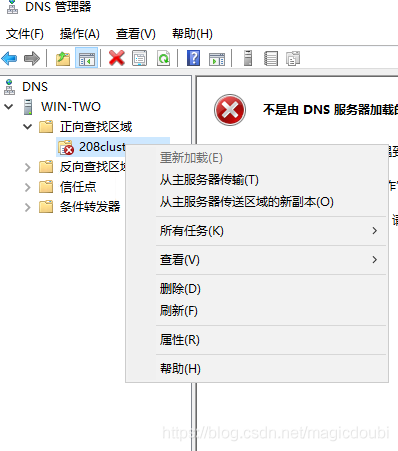  
5\. 刷新之后就可以了  
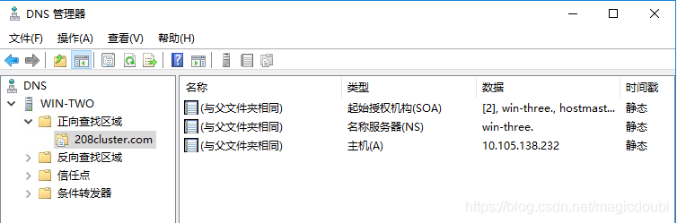

## 终端DNS解析

 这里有两种方式设置DNS:
### 1. 在指定网卡上设置DNS服务器地址
    - 右下角点击网络图标

[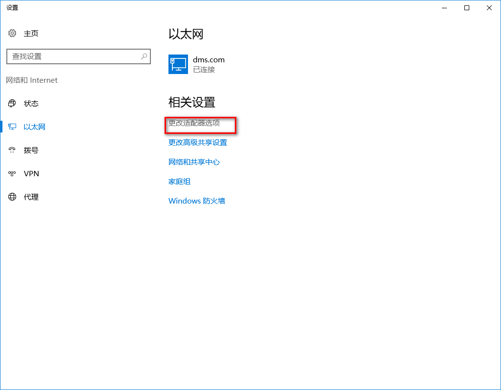](https://imgtu.com/i/5VA8yT)
[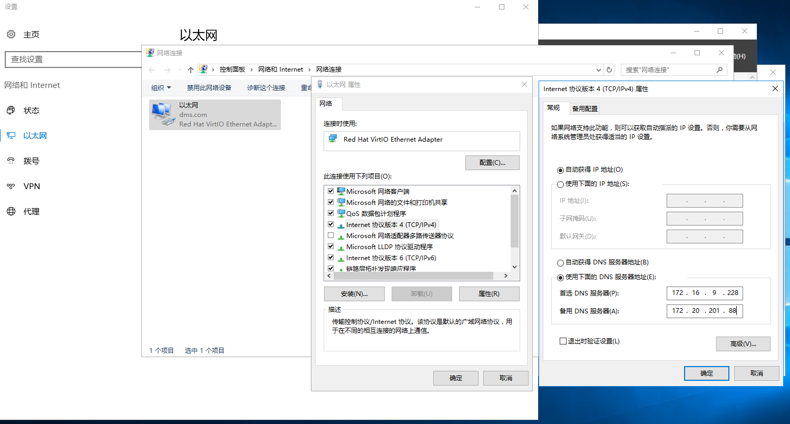](https://imgtu.com/i/5VAYmF)
### 2. 在路由器上指定DNS服务器地址 ==推荐==

