# NFS 功能安装
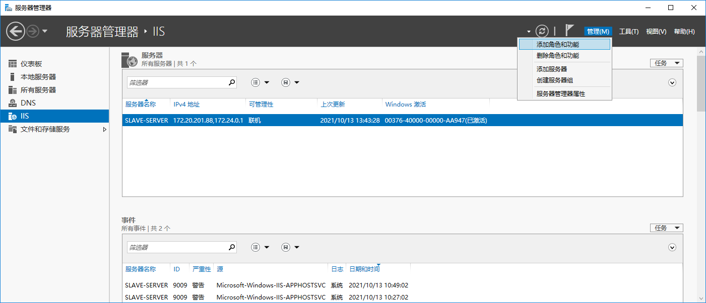
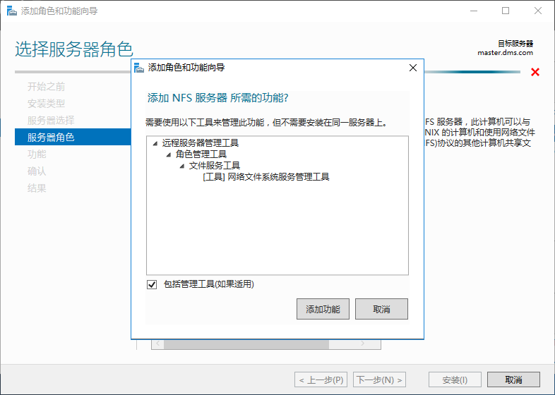
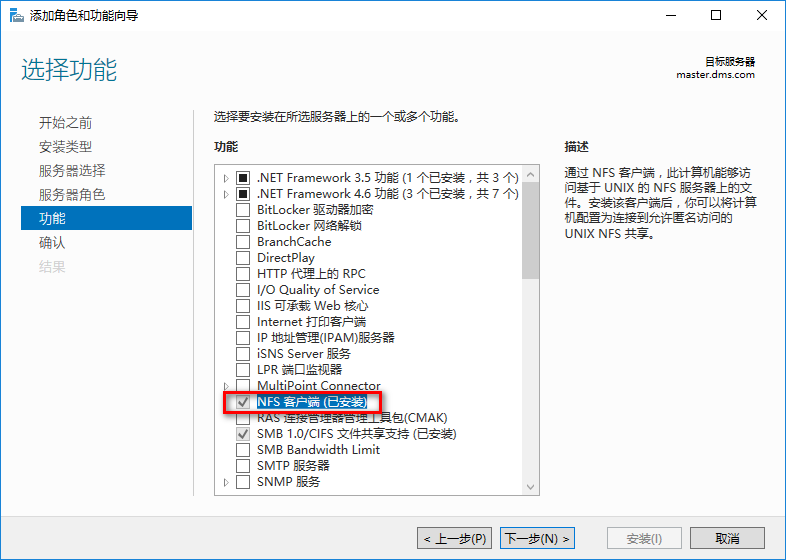
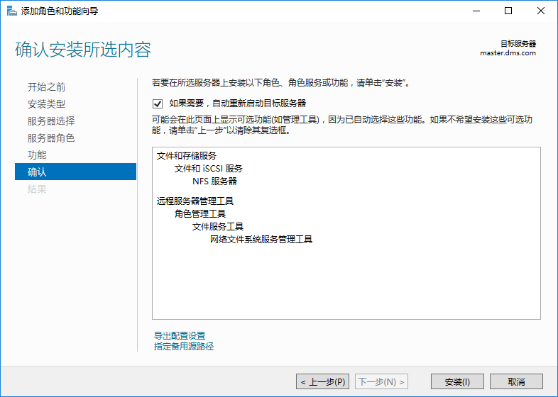
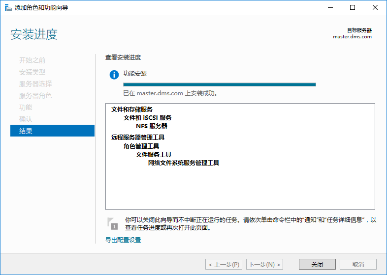

# NFS 文件夹设置
因为后续要做实例的HA，这里需要手动设置两个实例都能访问的文件夹。

## Master服务器
提供NFS功能的文件夹位于**master**服务器上
- master: **D:/NFS/files**
-
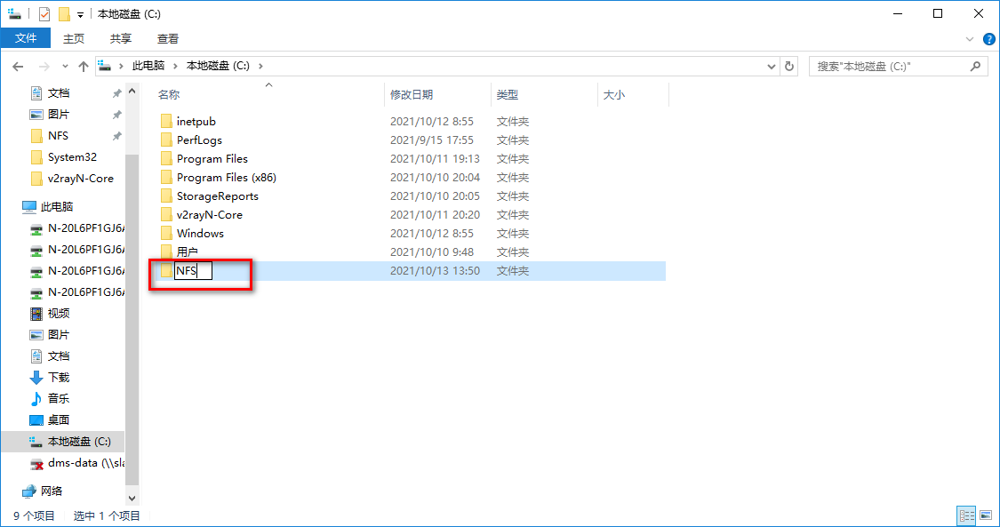
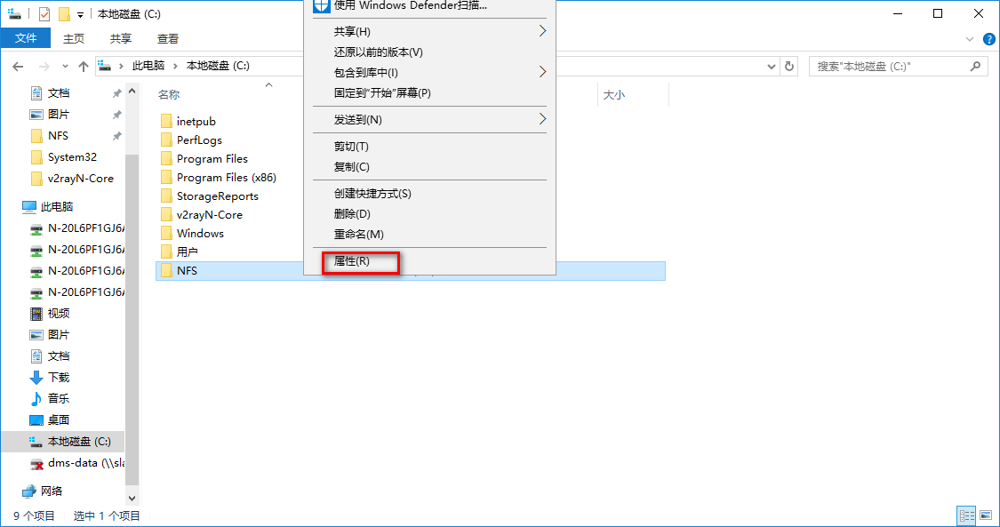
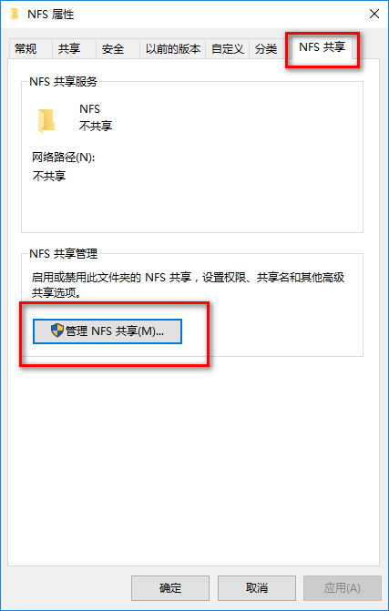
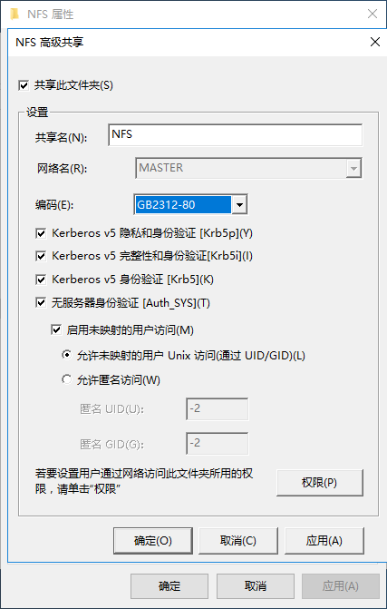
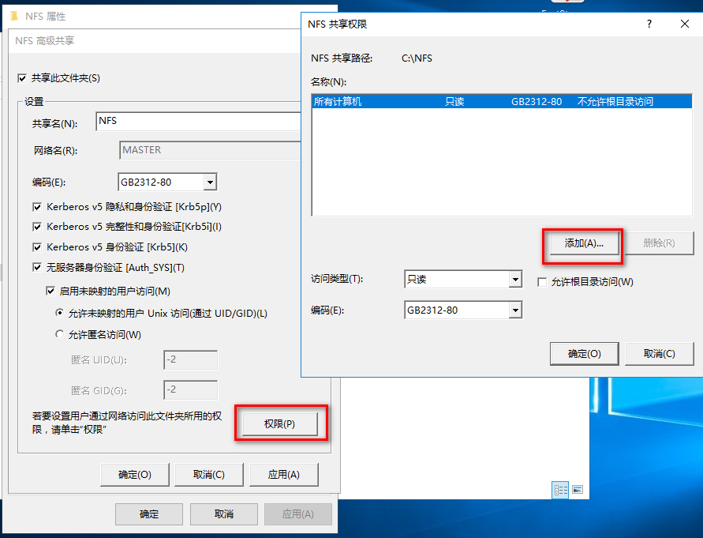
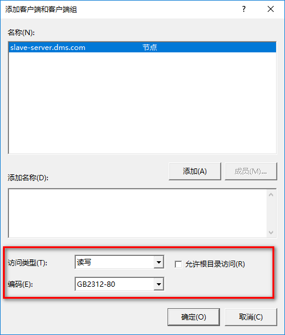
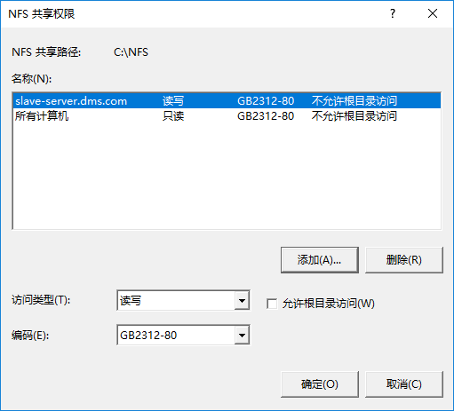
## Slave服务器
在**slave**服务器上，我们通过挂载卷的方式将刚才设置的NFS文件夹映射到本地文件夹：
- slave: E:/files

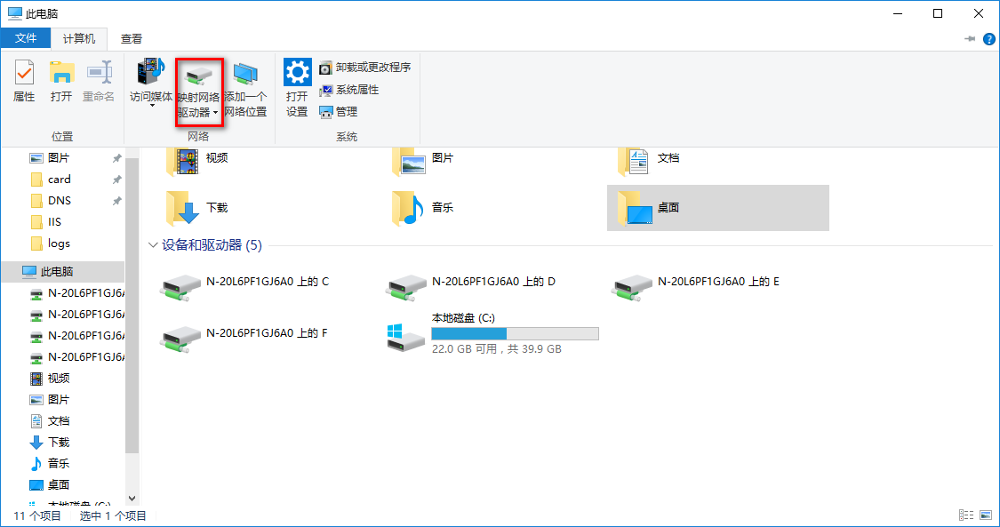
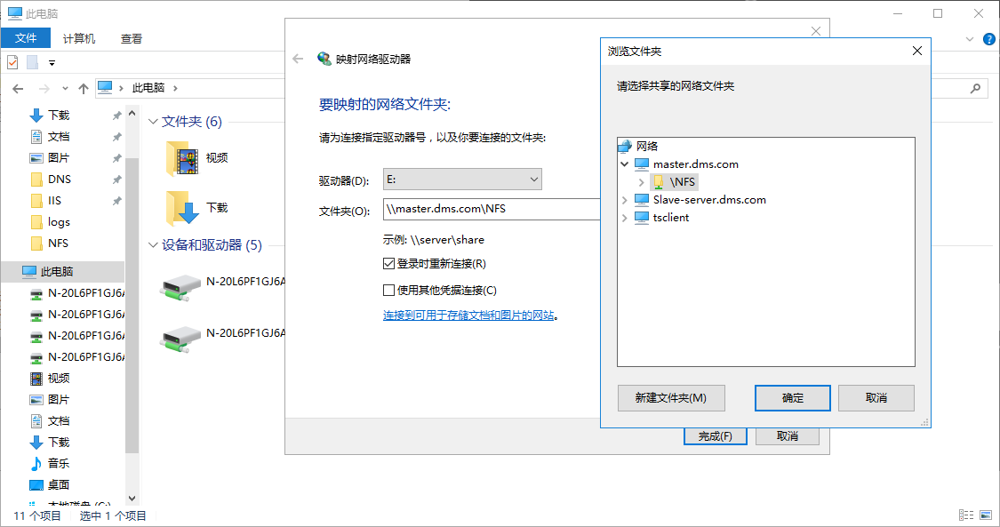

# 测试写入

拷贝一个文件，测试是否有写入/读取错误
