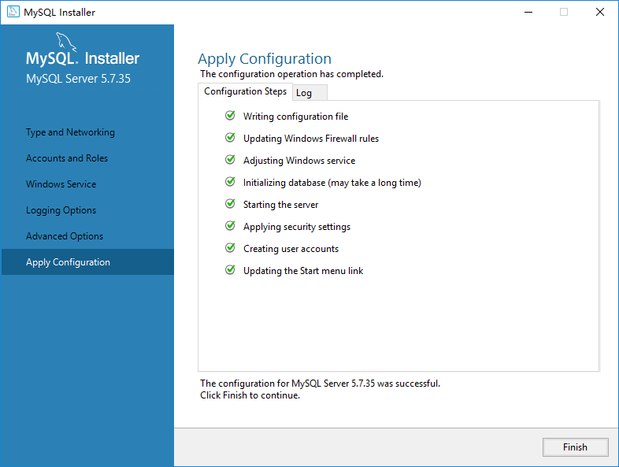

# MySQL 安装与配置
## 准备工作
- [下载 Microsoft Visual C++ 2013 Redistributable Package (x64)](https://download.microsoft.com/download/F/3/5/F3500770-8A08-488E-94B6-17A1E1DD526F/vcredist_x64.exe )
- [Microsoft Visual C++ 2019 Redistributable Package x64)](https://aka.ms/vs/16/release/VC_redist.x64.exe)
- [下载MySQL CE包： （5.7.25.0）](https://dev.mysql.com/downloads/file/?id=507211)

## 安装工作
> 默认情况下，MySQL会安装到C盘下，因为我们的数据盘是在D盘，因此我们需要手动建立一个文件夹`C:\Program Files (x86)\MySQL`，
> 这样在安装的时候才会出现下面的选项
>

### 选择安装类型


### 设置用户账号
设置根（root)用户账号 以及添加 执勤管理系统管理员账号 （dms)
- root/Aifuture123

### 服务配置


::: warning
 设置server ID 以及 表名的大小写相关性，
 注意：
 - **主 MySQL 这里需要设置为 1，从MySQL设置为2** ，
 - 表名敏感性选择 ： **lower_case_table_names = 1** 
 - `Bin Log` **项一定要选择**
:::





# 主从配置
> 本次主库：192.168.1.125
> 本次从库：192.168.1.124

## 主库配置
### 编辑主数据库的my.ini文件  
在[**mysqld**]节点中检查是否存在如下内容：
```
server_id=1 #指定唯一的ID，1至32，必须的
```

> 修改数据库之后需要重启数据库，才能使配置生效，然后建立一个备份账户，用于从库备份主库的数据。

### 修改MySQL数据库配置
1. 使用cmd窗口，进入路径`C:\Program Files\MySQL\MySQL Server 5.7\bin`，然后登陆数据库mysql -uroot -p，以下步骤都是在mysql命令行中完成

2. 运行以下命令，创建备份用户并赋予权限
```sql
# ip的位置可以为%，代表所有ip都能连接,IP 地址依据现场情况确定
 # identified by 'slave' 是为备份账户设置密码
grant replication slave on *.* to 'slave'@'192.168.1.124' identified by 'slave' ;
#刷新权限
flush privileges;
```


3. 查询是否创建成功
```sql
select user,host from mysql.user;
```

| user      | host      |
|-----------|:-------------:|
| root      | %         |
| slave     | 192.168.2.124        |
| mysql.sys | localhost |
| root      | localhost |


4. 显示主服务器的状态信息，并且找到File 和 Position 的值记录下来；
```
show master status;
+-----------------------+----------+--------------+------------------+-------------------+
| File                  | Position | Binlog_Do_DB | Binlog_Ignore_DB | Executed_Gtid_Set |
+-----------------------+----------+--------------+------------------+-------------------+
| DMS-MASTER-bin.000002 |     2082 |              |                  |                   |
+-----------------------+----------+--------------+------------------+-------------------+
```

## 从库配置

### 编辑从数据库的my.ini文件  
在[**mysqld**]节点中检查是否存在如下内容：
```
server_id=2 #指定唯一的ID，2至32，必须的，并且不能跟主数据库一样
```
### 命令行设置从库信息
1. 使用cmd窗口，进入从库路径 `C:\Program Files\MySQL\MySQL Server 5.7\bin`，然后登陆数据库mysql -uroot -p，以下步骤都是在mysql命令行中完成
2. 设置连接主库的信息，使用刚才新建的备份账户
```sql 
  # master_host 主库ip
  # master_user 之前新建的备份用户
  # master_password 备份用户密码
  # master_log_file 对应主库状态信息中的File字段
  # master_log_pos 对应主库状态信息中的Position字段
change master to master_host='192.168.1.125',master_user='slave',master_password='slave', master_log_file='DMS-MASTER-bin.000002',master_log_pos=2082;
```
3. 接下来启动slave
```sql
start slave;
```

4. 查看从库状态信息
```
mysql> show slave status \G;
*************************** 1. row ***************************
               Slave_IO_State: Waiting for master to send event
                  Master_Host: 192.168.1.125
                  Master_User: slave
                  Master_Port: 3306
                Connect_Retry: 60
              Master_Log_File: DMS-MASTER-bin.000002
          Read_Master_Log_Pos: 140080
               Relay_Log_File: DMS-SLAVE-relay-bin.000009
                Relay_Log_Pos: 140303
        Relay_Master_Log_File: DMS-MASTER-bin.000005
             Slave_IO_Running: Yes 
            Slave_SQL_Running: Yes
              Replicate_Do_DB:
          Replicate_Ignore_DB:
           Replicate_Do_Table:
       Replicate_Ignore_Table:
      Replicate_Wild_Do_Table:
  Replicate_Wild_Ignore_Table:
                   Last_Errno: 0
                   Last_Error:
                 Skip_Counter: 0
          Exec_Master_Log_Pos: 140080
              Relay_Log_Space: 141073
              Until_Condition: None
               Until_Log_File:
                Until_Log_Pos: 0
           Master_SSL_Allowed: No
           Master_SSL_CA_File:
           Master_SSL_CA_Path:
              Master_SSL_Cert:
            Master_SSL_Cipher:
               Master_SSL_Key:
        Seconds_Behind_Master: 0
Master_SSL_Verify_Server_Cert: No
                Last_IO_Errno: 0
                Last_IO_Error:
               Last_SQL_Errno: 0
               Last_SQL_Error:
  Replicate_Ignore_Server_Ids:
             Master_Server_Id: 1
                  Master_UUID: 99e9d6f0-3433-11ec-8ef1-000c299981cc
             Master_Info_File: D:\Data\MySQL\MySQL Server 5.7\Data\master.info
                    SQL_Delay: 0
          SQL_Remaining_Delay: NULL
      Slave_SQL_Running_State: Slave has read all relay log; waiting for more
           Master_Retry_Count: 86400
                  Master_Bind:
      Last_IO_Error_Timestamp:
     Last_SQL_Error_Timestamp:
               Master_SSL_Crl:
           Master_SSL_Crlpath:
           Retrieved_Gtid_Set:
            Executed_Gtid_Set:
                Auto_Position: 0
         Replicate_Rewrite_DB:
                 Channel_Name:
           Master_TLS_Version:
1 row in set (0.00 sec)

ERROR:
No query specified

```
::: tip
以上两项：
- Slave_IO_Running: Yes
- Slave_SQL_Running: Yes

都为**Yes**，则证明配置成功
:::
### 测试主从复制是否有效果  
在主数据库中创建一个新的数据库（或者数据表），然后切换到从数据库查看是否同样多出同名的数据库，或者数据表。有则表示主从复制成功。

## 遇到问题

### 1.修改mysql配置文件时不生效

查看修改的配置文件是否正确，我的mysql（5.7.12），安装生成的配置文件不在mysql安装目下，而是在mysql存放数据库的 /ProgramData 目录下面。另外，5.7的mysql中，不在使用“-”，而是使用“_”，注意编辑配置文件时不要出错。

### 2.配置时正常，但是测试是否同步时不能成功，查看状态之后发现：

Slave_SQL_Running: no  
报错：Last_SQL_Errno: 找不到数据库/数据表不存在  
这种情况是因为主库和从库不同步，或者可能是在从库上进行过写的操作（增删改），此时，删除主库和从库相关的数据库（为了保证清理干净），然后重新在主库中新建对应的数据库，再查看从库，同步成功。  
当Last_SQL_Errno: 0时，代表配置正确，主从复制正常。
