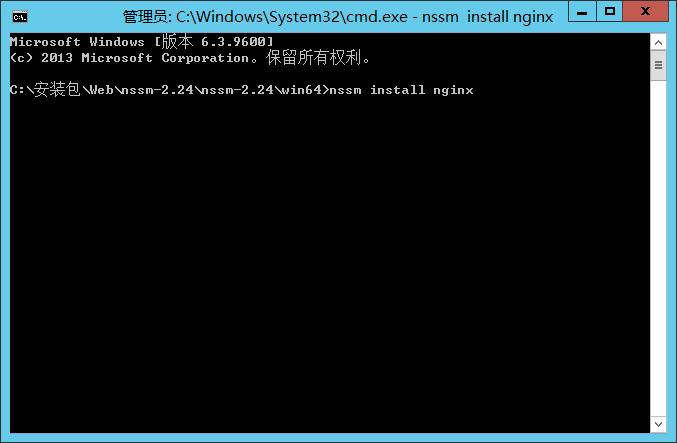
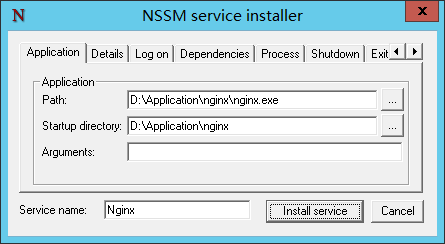
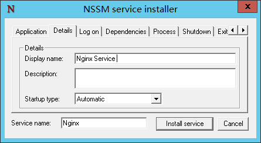
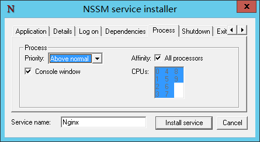
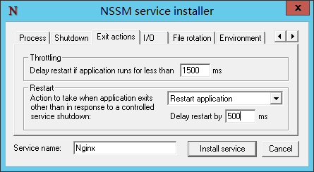
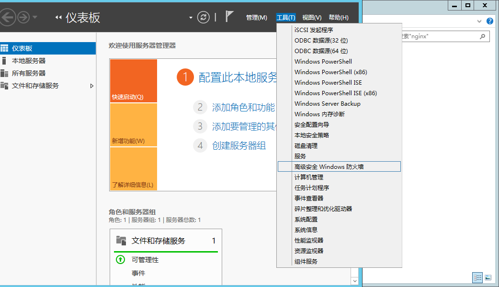
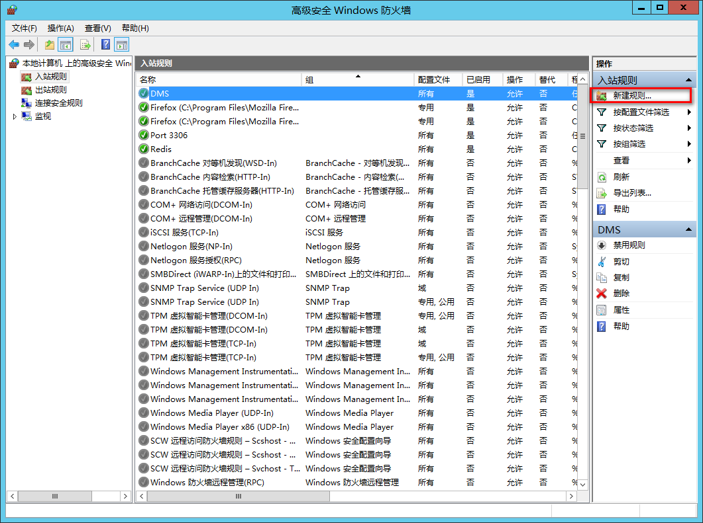
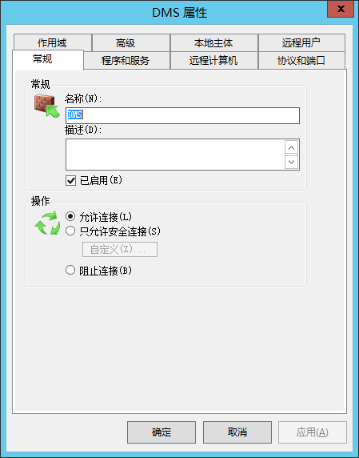
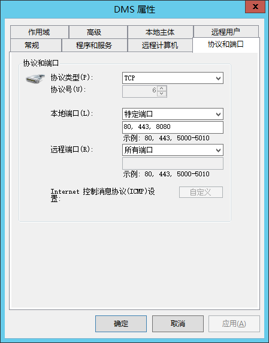

# 安装

1. 解压 nginx 安装包到 `D:\Application\` 目录下，解压完成后的目录结构如下：
```shell
D:\APPLICATION\NGINX
├─conf # 配置文件安装目录
├─contrib
│  ├─unicode2nginx
│  └─vim
│      ├─ftdetect
│      ├─ftplugin
│      ├─indent
│      └─syntax
├─docs
├─html
├─logs
├─temp
└─web # DMS前端安装目录
```
2. 解压前端安装包, 到`D:\Application\nginx\web` 目录下，解压完成后目录结构如下：
```shell
D:\APPLICATION\NGINX\WEB
└─dms #程序目录
    ├─hk
    │  ├─encryption
    │  ├─playctrl
    │  └─transform
    ├─html
    ├─map
    │  └─province
    └─static
        ├─css
        ├─fonts
        ├─img
        └─js
```
3. 检查`conf/nginx.conf`,内容如下：
```nginx configuration
worker_processes  2;
error_log  logs/error.log;

events {
  worker_connections  1024;
}

http {
  include       mime.types;
  default_type  application/octet-stream;
  sendfile        on;
  keepalive_timeout  65;
  # gzip压缩功能设置
  gzip on;
  gzip_min_length 1k;
  gzip_buffers    4 16k;
  gzip_http_version 1.0;
  gzip_comp_level 6;
  gzip_types text/html text/plain text/css text/javascript application/json application/javascript application/x-javascript application/xml;
  gzip_vary on;
  # http_proxy 设置
  client_max_body_size   30m;
  client_body_buffer_size   128k;
  proxy_connect_timeout   75;
  proxy_send_timeout   75;
  proxy_read_timeout   75;
  proxy_buffer_size   4k;
  proxy_buffers   4 32k;
  proxy_busy_buffers_size   64k;
  proxy_temp_file_write_size  64k;
  proxy_temp_path   ./temp/proxy_temp 1 2;
  server {
    listen       80;
    server_name  localhost;

    location / {
      root   ./dms/dist;
      try_files $uri $uri/ /index.html;
      index  index.html index.htm;
    }

    location /api/{
      proxy_set_header Host $http_host;
      proxy_set_header X-Real-IP $remote_addr;
      proxy_set_header REMOTE-HOST $remote_addr;
      proxy_set_header X-Forwarded-For $proxy_add_x_forwarded_for;
      proxy_pass http://127.0.0.1:8080/dms-admin;
    }

    error_page   500 502 503 504  /50x.html;
    location = /50x.html {
      root   html;
    }
  }
}

```
4. 设置nginx服务
 
   
   
   
   
5. 设置防火墙 





6. 启动nginx服务器，在浏览器输入`http://<本机IP>` 测试安装效果
