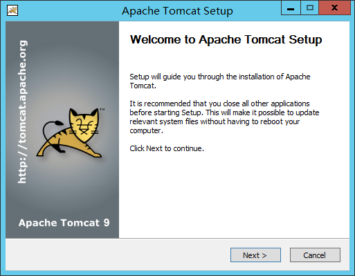

# 准备工作
- 从安装包中选取并安装JDK，默认选择即可
# 开始安装

**管理员** 设置：
- root/Aifuture123

安装路径：
- D:\Application\Apache Software Foundation\Tomcat 9.0 

## 配置Tomcat启动

> Java Options:
- -Dspring.profiles.active=prod
> 内存选项：
- 初始内存：2048M
- 最大内存：8192M

##  安装后配置
拷贝` 安装包\Web\tomcat-native-1.2.31-openssl-1.1.1l-win32-bin\bin\x64` 下的文件到 `D:\Application\Apache Software Foundation\Tomcat 9.0\bin`
