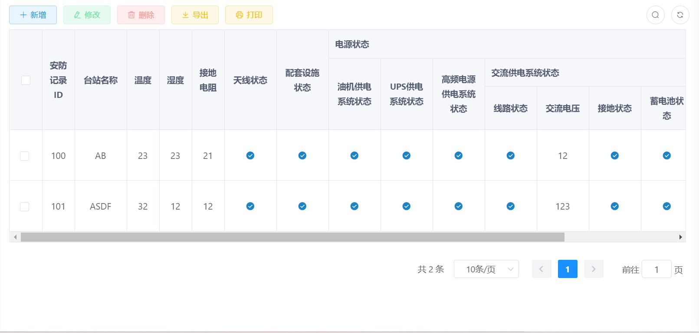
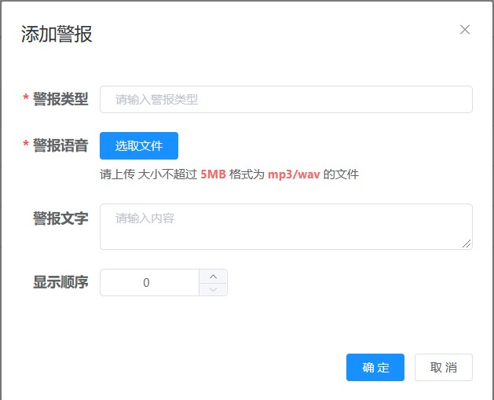

## 1 操作说明

| 操作   | 步骤                                                         | 备注                                                         |
| ------ | ------------------------------------------------------------ | ------------------------------------------------------------ |
| 新增   | 单击列表左上方【新增】，弹出添加框，输入信息，上传文件，单击【确定】，提示新增成功 | 上传文件时要注意文件格式和大小限制                           |
| 修改   | 列表右侧点击【修改】或者选中一个装备后在列表左方点击【修改】，编辑需要修改的信息，单击【确定】，提示修改成功 | 选中多行时，左上角修改按钮不可用                             |
| 删除   | 在列表右侧点击【删除】或者选中行后在列表上方点击【删除】，单击确定，提示删除成功 |                                                              |
| 导入   | 单击列表左上方【导入】，选择/拽托文件，单击【确定】，弹出导入结果提示信息 | 导入文件格式为xls、xlsx；  可点击下载模板，下载对应列表模板  |
| 导出   | 单击列表左上方【导出】，输入操作用户密码和管理员ID、密码，单击确定，在导出提示框选择【确定】，导出列表信息为xlsx文件 | 进行导出、打印操作时需要进行二次验证，需要输入正确的操作人员密码，管理员ID、密码，验证通过才能进行导出、打印操作 |
| 打印   | 单击列表左上方【打印】，输入操作用户密码和管理员ID、密码，单击确定，在打印提示框单击【确定】，打印列表信息 |                                                              |
| 查询   | 单击列表右上角搜索符号，展开搜索栏，在搜索栏输入查询信息，单击【搜索】，查询列表信息 |                                                              |
| 下载   | 在【应急管理】模块，单击【下载】，进行预案文件或者警报音频下载操作。 |                                                              |
| 显隐列 | 在列表右上角显隐列按钮，点击选择哪些数据项显示在列表中       |                                                              |

​                                **注：word中打开时，在文中点击超链接跳转到其他模块时，按alt+****⬅****返回原位置**

## 2 首页

### 2.1 用户登录

在浏览器输入网址http://119.3.92.140/  进入系统登录页面

输入正确的用户名，密码和验证码，点击登录，即可进入系统

**注：普通用户登录时不能进行新增、修改、删除、导入、导出、打印、下载等操作，只能看到列表显示信息，对列表进行查询操作和修改个人中心信息**

### 2.2 首页展示

系统首页主要用来展示基地地图、基地装备信息、值班、执勤信息等

**菜单栏**

左侧菜单栏为各项功能菜单，右上方菜单栏为系统布局，个人中心和退出登录

​

### 2.3 个人中心

用户登录系统后，无论是否分配角色都可对用户个人信息进行修改，

个人中心从页面右上角菜单栏进入

个人中心显示用户的基本资料，可修改自己的资料，修改密码

进行修改密码操作时，需要先输入旧密码，然后两次输入相同的新密码，单击保存

**注：当用户忘记密码时，需要管理员为用户重置密码（[系统管理—用户管理—更多—重置密码](#_用户管理)）**

## 3 装备管理

装备管理模块分为装备列表、装备状态、装备性能、装备维护、装备执勤几个部分，主要进行基地的装备管理，包括装备数量、部署信息、执勤状态、维护状态、性能信息、基本配置等

### 3.1 装备列表

装备列表分为实有装备和应编装备两个部分，实有装备为基地实际拥有的装备，应编装备为基地按照规定应该配备的装备。

#### 3.1.1    实有设备

实有装备列表显示实有装备信息：装备台站、类型、名称、编号、型号、生产日期、列装时间

有新增、修改、删除、导入、导出、打印、查询操作

****前置条件**：在新建实有装备时应先新建好台站信息（[台站管理--台站信息—新建](#_台站信息)）**

​

（1）【新增】实有装备：输入设备信息，上传设备图片，单击确定

（2）点击列表右侧【查看】，查看装备图片

（3）【修改】实有装备

（4）【导入】实有装备：选择或拽托文件上传文件（可点击下载模板，下载列表对应列表数据项模板），文件类型为xls、xlsx

（5）【导出】实有装备：导出列表时需进行二次验证，验证通过方可进行导出操作

（6）【打印】实有装备：打印列表时需进行二次验证，通过验证才可进行打印操作

（7）【查询】实有装备：可选择/输入一个或者多个关键字，单击搜索进行查询

#### 3.1.2    应编设备

【应编装备】列表显示应编装备信息：装备名称、编号、型号、数量

有新增、修改、删除、导入、导出、打印、查询操作

**前置条件：在新建应编装备时应先在实有装备列表新建好实有装备（[装备管理—装备列表—实有装备—新建](#_实有设备)），应编装备为实有装备中装备应配备的数量**

### 3.2 装备状态

装备状态主要用于记录实有装备的工作状态

【装备状态】列表显示装备信息及工作状态，装备工作状态分为良好、损坏。

有新增、修改、删除、导入、导出、打印、查询操作​

**前置条件：在新建装备状态时应先在实有装备列表新建好实有装备（[装备管理—装备列表—实有装备—新建](#_实有设备)）**

​

【新增】装备状态：选择装备和装备工作状态（良好/损坏）

### 3.3 装备性能

装备性能主要用于记录实有装备的各项性能信息

【装备性能】列表显示装备性能指标：装备频率、装备功率、调制度、误码率

有新增、修改、删除、导入、导出、打印、查询操作
​
**前置条件：在新建装备状态时应先在实有装备列表新建好实有装备（[装备管理—装备列表—实有装备—新建](#_实有设备)）**
​

【新增】装备性能：选择装备，输入装备频率、功率、调制度、误码率

### 3.4 装备维护

装备维护主要用于管理哪些装备进行了维护，装备维护时间为多久和装备维护的工作内容

【装备维护】列表显示装备维护信息：装备信息、维护类型、维护时间、工作内容、维护人员，按维护时间长短分为日维护、周维护、月维护、半年维护

有新增、修改、删除、导入、打印、查询操作​

**前置条件：在新建装备状态时应先在实有装备列表新建好实有装备（[装备管理—装备列表—实有装备—新建](#_实有设备)）**

​

【新增】装备维护：按日维护、周维护、月维护、半年维护，在进行新增操作时可选择哪天/周/月/半年进行维护工作

### 3.5 装备执勤

装备执勤模块分为装备执勤和保障类别两部分，保障类别为装备进行了什么保障工作，如信息战备值勤、飞行训练保障、作战（演习）保障、其他任务保障等。

#### 3.5.1    装备执勤

【装备执勤】列表显示装备执勤信息：装备信息、保障类别、工作状态、保障开始结束时间，执勤人员

有新增、修改、删除、导入、打印、查询操作
​

**前置条件：在新建装备状态时应先在实有装备列表新建好实有装备（[装备管理—装备列表—实有装备—新建](#_实有设备)），然后新建好装备保障类别（[装备管理—装备执勤—保障类别](#_保障类别)）**

​

【新增】装备执勤：新增装备执勤时必须上传装备照片，选择执勤开始结束时间

### 3.5.2    保障类别

【保障类别】列表显示保障类别信息：分类名称、创建时间

有新增、修改、删除、查询操作

​

【新增】保障类别：新增时可选择上级节点，显示顺序

## 4 数据统计

### 4.1 基站首页

在基站首页以图表形式展示基地人员统计，装备数量、执勤情况、维护情况、工作状态、部署位置数量分布统计以及视频抓拍用量等统计信息。

## 5 现场管理

为有效做好值勤现场管理记录留存和远程装备维护指导工作，值勤系统需要 能够接入海康、大华等主流品牌的视频监控设备（能够与当前台站已有的海康系 列设备兼容），并进行实时监控。搭建视频服务器，接入现场视频流，然后将视 频流转换为视频服务器可以访问的视频流协议，实现实时视频监控

### 5.1 摄像头管理

在【摄像头管理】列表显示系统接入的摄像头信息：摄像头型号、ip、登录名、登陆密码、端口、流地址、备注

有新增、修改、删除、查询操作​

**前置条件：在新建摄像头时应添加摄像头所在台站的台站信息（[台站管理—台站信息—新建](#_台站信息)）**

​

点击【查看】，可查看摄像头详情，在详情页面可进行抓拍图片和定时抓图设置

### 5.2 摄像头预览

摄像头预览页面可查看、搜索对应摄像头，在页面下方可选择分屏，选择一个页面显示几个摄像头

**前置条件：想要预览摄像头画面需要先添加好需要预览的摄像头信息（[现场管理—摄像头管理—新建](#_摄像头管理)）**

### 5.3 图片管理

在【图片管理】列表可以查看、删除抓拍的图片信息：台站、摄像头号、文件名、地址、创建时间

**前置条件：在进行抓拍图片信息管理之前需要先设置图片抓拍信息（[现场管理—摄像头管理—查看—定时抓图设置/抓图](#_摄像头管理)）**

## 6 台站管理

台站管理模块分为台站信息、台站安防、指示记录、台站检查、动环状态、值班管理、其他事项几个部分，用于记录台站信息、台站安防状态、发送指示信息、记录上级检查情况、记录台站值班信息和其他事项

### 6.1 台站信息

台站信息用于记录各个台站的基本信息，用户登录时，只能看到自己所在军区下的台站信息

在【台站信息】列表显示台站信息：台站id、名称、关键机构、坐标、agentIP、状态、编制员额

有新增、修改、删除、导出、查询操作​

**前置条件：在新建台站前应先建立好相关机构部门信息（[系统管理—部门管理—新建](#_部门管理)）**

​

【新增】台站：在新建台站时，Agent Ip地址格式为：IP:PORT，如：1.2.1.0:80

点击台站名称，可进入对应台站首页，台站各项数据状态信息会以图表形式展示出来

### 6.2 台站安防

台站安防用于记录台站各项安防设施的检查信息状态，有正常、异常两个状态

在【台站安防】列表显示台站安防状态：台站ID、台站设施状态、报警设施状态、警报设施状态、消防设施状态、防盗设施状态及记录时间

有新增、修改、删除、导出、打印、查询操作​

**前置条件：在新建台站安防信息前应先建立好台站信息（[台站管理—台站信息—新建](#_台站信息)）**

​

【新增】台站安防：在新增台站安防信息时需要选择记录某天该台站的各项安放信息状态（正常/异常）

### 6.3 指示记录

指示记录用于记录上级下发的指示，指示发送到哪个台站，发送指示单位，指示内容，指示人员

在【指示记录】列表显示指示信息：指示记录ID、台站名称、指示时间、单位、内容、指示者、记录人员）

有新增、修改、删除、导出、查询操作​

**前置条件：在新建指示记录信息前应先建立好台站信息（[台站管理—台站信息—新建](#_台站信息)）**

### 6.4 台站检查

台站检查用于记录上级单位来台站检查指导工作的情况，需要如实记录上级检查工作情况、给出的意见

在【台站检查】列表显示台站检查信息：指示时间、单位、内容，检查问题、意见、备注，记录人员

有新增、修改、删除、导出、查询操作 ​

**前置条件：在新建台站检查信息前应先建立好台站信息（[台站管理—台站信息—新建](#_台站信息)）**

### 6.5 动环状态

动环状态主要用于记录各个台站的动力设施和环境指标的数据状态

在【动环状态】列表显示动环检测信息：温度、湿度、接地电阻、天线状态、电源状 态、配套设施等

其中，电源状态包括交流供电系统状态、油机供电系统状态、 UPS 供电系统状态、高频率电源供电系统状态等。交流供电系统状态细分为线路 状态、电压、接地状态、蓄电池状态等。

有新增、修改、删除、导出、查询操作​

**前置条件：在新建动环状态信息前应先建立好台站信息（[台站管理—台站信息—新建](#_台站信息)）**

### 6.6 值班管理

值班管理用于记录各个台站的值班情况，主要记录值班时间、人员、值班类型等

在【值班管理】列表显示值班人员的值班信息：台站、值班人员、开始结束日期、值班类型

有新增、修改、删除、导出、打印、查询操作​

**前置条件：在新建台站值班信息前应先建立好台站信息（[台站管理—台站信息—新建](#_台站信息)）和值班人员信息（[系统管理—人员管理—新建](#_人员管理)）**

### 6.7 其他事项

其他事项主要用于记录与上述记录内容没有涵盖的其他事项内容

【其他事项】列表：台站名称、事项ID、时间、地点、人员、内容、记录名

有新增、修改、删除、导出、打印、查询操作

**前置条件：在新建台站其他事项信息前应先建立好台站信息（[台站管理—台站信息—新建](#_台站信息)）**
​

## 7 应急处置

应急处置模块分为预案管理、故障申告、警报类型、警情传递、警情回馈几个部分，主要用于存储、编辑和调取台站建设管理各类方案、预案；设置装设备故障申告模块；设置警报信号传递模块，通过预先设置警报信号铃声来判断警报信号类型，传递过程中需设置传递到哪个台站（目标台站）、警报信息号内容、警报时间等要素统计功能，接收终端在接收到警报信号后进行回执。

### 7.1 预案管理

预案管理主要用于管理应急预案信息，新建预案时需要上传预案文件，用户可以下载查看列表中的预案文件

在【预案管理】列表显示预案信息：文案名称、类型、关键字

有新增、修改、删除、文案下载、查询操作

​

【新增】预案：填写预案信息，按文件类型、大小要求上传文件，单击确定

【下载】预案：单击列表右侧下载，可下载预案文件

### 7.2 故障申告

故障申告用于向工作人员申告故障信息，需要写明故障类型、初步处理时间和处理人员，工作人员收到故障申告后处理故障，给出回执信息

在【故障申告】列表显示故障申告信息：故障名称、类型，处理时间、部门、人员、状态，回执内容、人员、时间（回执人员为当前登录处理回执用户）

有新增、修改、删除、导出、打印、查询、回执操作

​

**回执处理故障**：点击列表右侧回执，输入回执内容，选择回执时间，单击确定，对故障进行回执处理操作

**注：已回执的故障不能再进行修改操作**

### 7.3 警报类型

警报类型模块主要通过设置警报对应的警报铃声，让人听到铃声后能够判断属于什么警报信息，然后传递警情

在【警报类型】列表显示警报信息：警报类型、文字、创建时间

有新增、修改、删除、下载警报音频、查询操作

​

【新增】警报：输入警报信息，按音频文件要求上传警报语音音频，单击确定

【下载】警报：在列表右侧单击下载，可下载警报音频文件

### 7.4 警情传递

警情传递主要通过设置的警报音频判断警报类型，发送警情信息到各个台站，台站收到后需要发回反馈信息

在【警情传递】列表显示警报信息：警报类型、级别，目标台站，备注、开启时间、是否开启反馈、创建时间

有新增、删除、查看传递详情、查询操作​

**前置条件：在新建警情传递信息前应先建立好目标台站（[台站管理—台站信息—新建](#_台站信息)）和警报类型（[应急处置—警报类型—新建](#_警报类型)）**

​

添加警情传递时可选择多个目标台站，警情信息会下发到各个目标台站

在查看传递详情时可打开自动刷新，刷新（每2s刷新一次）显示传递详情状态

可点击重发，重新发送警报到目标台站

### 7.5 警情回馈

台站在收到警情信息后会发回反馈信息，用户可在警情回馈模块查看请反馈信息和警情下发状态

在【警情回馈】列表显示回馈信息：警报信息、目标台站、是否开启反馈、传递状态、回执人员、内容、时间

有导出、打印、查询操作

**注：开启反馈的警报在下发成功后可查看反馈信息**

## 8 系统监控

### 8.1 在线用户

在线用户模块主要用于记录当前登录系统的各个用户的账户信息、登录信息，包括登录名称、部门名称、主机IP、登陆地点、浏览器、操作系统、登陆时间

有查询、强退操作。强退操作可以强制退出在线用户

### 8.2 定时任务

在【定时任务】页面显示定时任务信息：任务名称、组名、调用目标字符串、cron执行表达式、状态

有新增、修改、删除、导出、查询操作

​

点击【日志】，可查看调度日志信息：任务信息、执行状态、时间

有删除、清空、导出、关闭、查询、查看详情操作

点击列表右侧更多，可选择执行操作、查看任务详情、查看任务调度日志

调度日志

任务详情

### 8.3 数据监控

### 8.4 服务监控

【服务监控】：监控CPU、内存，服务器、Java虚拟机、磁盘使用状况

### 8.5 缓存监控

【缓存监控】：监控缓存信息：基本缓存信息、命令统计、内存信息

## 9 系统工具

### 9.1 表单构建

在左侧组件栏选择添加组件，在右侧属性栏调整组件属性和表单属性，单击【导出vue文件】，导出构建好的表单对应vue文件，点击【复制代码】，将表单对应代码复制至剪切板，粘贴至需要的地方，点击【清空】，清除添加的组件

## 10     系统管理

系统管理模块分为，主要用于管理系统的各项事务，如系统用户管理，基地人员管理，系统角色管理，系统功能菜单管理、基地部门机管理、领导人员岗位信息管理以及其他信息。

### 10.1    用户管理

用户管理用于管理系统用户，可用过用户账号登录系统，管理员可以新建用户，新建用户时需要输入：用户身份信息、联系方式、职务信息等

新建用户完成后可为其分配角色信息，让用户可以进行其他操作（没有分配角色的用户登录系统只能查看系统首页，修改个人信息）

【用户管理】列表显示用户信息,列表左侧为部门信息，管理员可在列表状态栏对用户进行停用启用操作​

​     **前置条件：在新建用户时应先设置好用户所属机构部门（[系统管理—部门管理—新建](#_部门管理)）和用户将要被分配的角色信息（[系统管理—角色管理—新建](#_角色管理)）**

​

【新增】用户：新增用户时有设置用户默认密码，可以修改默认密码

【修改】用户：修改用户信息时没有修改密码操作，用户可在个人中心修改密码

用户列表右侧单击更多，可选择为用户重置密码、分配角色

重置密码：输入新的密码，单击确定

分配角色：选择角色，单击提交

### 10.2    人员管理

人员管理用于记录基地人员信息，包括人员基本信息和在位情况

【人员管理】列表展示人员信息：人员编号、姓名、所属台站、性别、照片、生日、级别、职务、宗教、技能、在位状态

有新增、修改、删除、导出、查询操作

**前置条件：在新建基地人员信息时应先新建好台站信息（[台站管理--台站信息—新建](#_台站信息)）**

### 10.3    角色管理

角色管理用于管理系统角色信息，系统设置有一个超级管理员，可在角色管理模块添加设置其他管理员，选择管理员拥有的各项权限，并为其分配用户（管理在新建用户后会为其选择角色信息）

**注：当系统停用某个角色时，该角色下的用户登录系统时将不能进行其他操作，只能看到系统首页、修改个人信息**

【角色管理】列表展示角色信息：角色名称、权限字符、绑定IP、状态，可对除超级管理员之外的角色进行分配用户操作

有新增、修改、删除、导出、打印、查询操作

​

【新增】角色：在进行新增角色操作时，需对角色进行权限选择，确认角色拥有的权限。

点击列表右侧分配用户，可为除超级管理员之外的角色分配用户

在分配角色页面点击【添加用户】，选择用户，单击确定，为角色分配用户成功

### 10.4    菜单管理

菜单管理主要用于管理系统的各个功能模块，用于编辑各功能模块信息，选择启用/停用某个模块

【菜单管理】列表显示系统界面左侧功能菜单栏信息：菜单名称、图标、排序、权限、状态、创建时间

有新增、修改、删除、查询操作

​

【新增】菜单：选择是否为外部链接，如果是，路由地址为链接地址网址，如：http://www.baidu.com

### 10.5    部门管理

部门管理主要用于管理基地各级部门机构，从上到下按机构层级管理，每个用户都有自己所属的部门机构

在【部门管理】列表显示部门机构和和其下级部门从属关系

有新增、修改、删除、查询操作

​

【新增】部门机构：新增部门机构时可选择上级机构

### 10.6    岗位管理

岗位管理用于管理各级领导负责人岗位信息

在【岗位管理】列表显示岗位信息：岗位编码、名称、排序，状态，创建时间

有新增、修改、删除、导出、打印、查询操作

### 10.7    字典管理

在【字典管理】列表显示字典信息：字典编号、名称、类型、使用状态、备注、创建时间

有新增、修改、删除、导出、刷新、查询操作

### 10.8    参数设置

在【参数设置】列表显示参数信息：参数主键、名称、键名、键值、是否系统内置、备注、创建时间

有新增、修改、删除、导出、刷新、查询操作

### 10.9    通知公告

在【通知公告】列表显示系统通知公告信息，如：维护、更新（公告标题、类型、状态、创建者、创建时间）

有新增、修改、删除、查询操作

### 10.10  日志管理

日志管理用于记录系统操作日志和用户登录日志信息

### 10.10.1 操作日志

在【操作日志】列表显示用户在系统进行的各项操作，包括操作类型、操作作用板块、请求方式、操作人员、时间、地址、地点、状态（成功/失败）

有删除、清空、导出、查询操作

### 10.10.2 登录日志

在【登录日志】列表显示用户登录信息，包括用户名称、登录地址、地点、日期、浏览器、操作系统、状态（成功/失败）、操作信息（操作成功/操作失败原因）

有删除、清空、导出、查询操作

